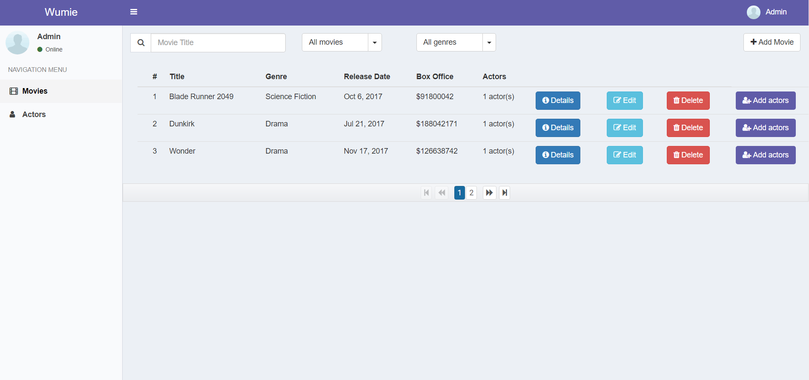

### Wumie is a web application for managing movies.
---

- [Functionalities](#functionalities)
    + [Normal User](#normal-user)
    + [Admin](#admin)
- [Implementation](#implementation)
    + [Exposed API endpoints](#exposed-api-endpoints)
        * [Movies](#movies)
        * [Actors](#actors)
        * [Auth](#auth)
- [Screenshots](#screenshots)

## Functionalities

#### Normal User

- View movies
- View movie details
- Add a movie to watchlist
- View actors
- View actor details

#### Admin

Same as normal user, plus:

- Create movie
- Edit movie
- Delete movie
- Create actor
- Edit actor
- Delete actor
- Add actors to movie

## Implementation

Wumie is a **SPA** (single page application).

- Components
    - **Web client**
    - **Backend server**

- The web client is a Javascript application made with Angular.

- **The backend server exposes a RESTful API and serves JSON data to the web client**. The API can be consumed by other clients too (e.g. mobile apps).

- The backend server is implemented using two technology stacks (for learning purposes): **Java (Spring framework)** and **.NET Core**. The functionality is the same, only the technology stack differs.

- Regarding security, the user logs in with user & password and gets an **JWT access token**, that will be used for authorization purposes.

#### Exposed API endpoints

##### Movies
- Get movies
    - `GET /api/movies`
- Get movie details
    - `GET /api/movies/{id}`
- Get actors that starred in a movie
    - `GET /api/movies/{id}/actors`
- Update movie
    - `PUT /api/movies/{id}`
- Create movie
    - `POST /api/movies`
- Delete movie
    - `DELETE /api/movies/{id}`
- Create movie
    - `POST /api/movies`
- Add actors to movie
    - `POST api/movies/{id}/actors`
- Add movie to watchlist
    - `POST api/movies/{id}/watch`
- Remove movie from watchlist
    - `DELETE api/movies/{id}/watch`

##### Actors
- Get actors
    - `GET /api/actors`
- Get actor details
    - `GET /api/actors/{id}`
- Get movies that actor starred in
    - `GET /api/actor/{id}/movies`
- Update actor
    - `PUT /api/actors/{id}`
- Create actor
    - `POST /api/actors`
- Delete actor
    - `DELETE /api/actors/{id}`

##### Auth
- Login
    - `POST /api/auth/login`
- Sign up
    - `POST /api/auth/signup`

## Screenshots

### View movies (as normal user)

### View movies (as admin)

### View movie details

### View actors (as normal user)

### View actors (as admin)

### View actor details

### Add actors to movie

